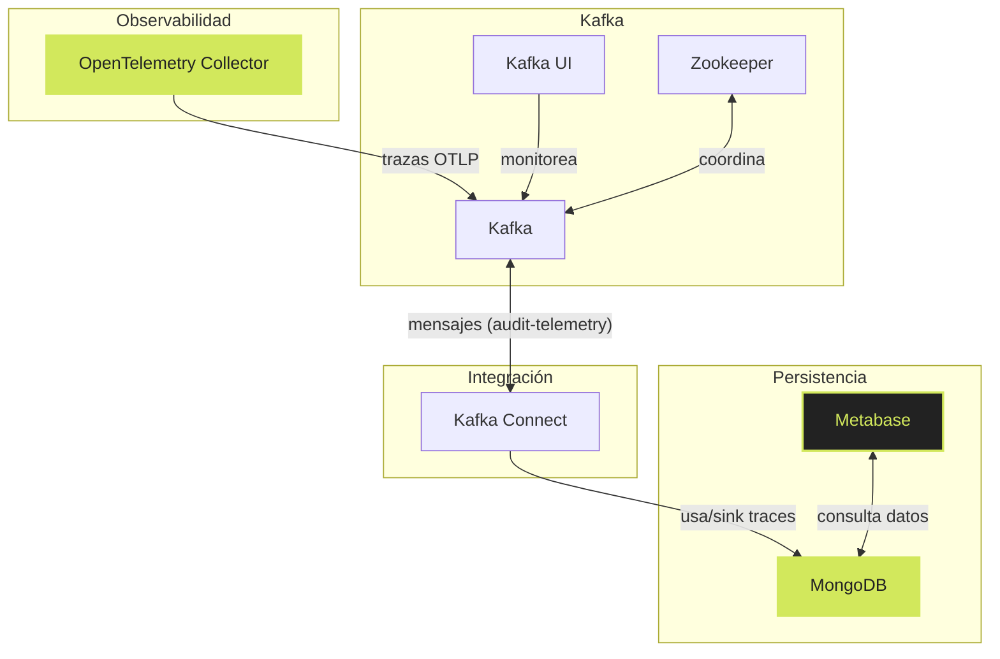

# Architectura de Telemetría con Docker


## Descripción de la arquitectura:

1. **OpenTelemetry Collector**: Es el componente encargado de recibir las trazas en formato OTLP y enviarlas a Kafka para su posterior procesamiento.

2. **Kafka**: Es el sistema de mensajería que almacena las trazas recibidas del OpenTelemetry Collector. Kafka se encarga de gestionar la cola de mensajes y garantizar la entrega de los datos.

3. **Kafka UI**: Es una interfaz gráfica que permite monitorear el estado de Kafka, visualizar los mensajes en las colas y gestionar los tópicos.

4. **Zookeeper**: Es un servicio de coordinación que se utiliza para gestionar el clúster de Kafka, asegurando la alta disponibilidad y la sincronización entre los nodos.

5. **Kafka Connect**: Es una herramienta que permite conectar Kafka con otros sistemas, en este caso, se utiliza para enviar las trazas desde Kafka a MongoDB.

6. **MongoDB**: Es la base de datos NoSQL donde se almacenan las trazas procesadas por Kafka Connect. MongoDB permite una fácil consulta y análisis de los datos.

7. **Metabase**: Es una herramienta de visualización y análisis de datos que se conecta a MongoDB para consultar las trazas almacenadas y generar informes y dashboards.

## Pasos para ejecutar la arquitectura:

**Configurar variables de entorno**: Asegúrate de tener un archivo `.env` con la variable `MONGO_PASSWORD` configurada para la contraseña de MongoDB.

**Iniciar los servicios con Docker Compose**: Ejecuta los siguientes comandos en la terminal para construir y levantar los contenedores:

```bash
cd /dockerTelemetria

docker compose build

docker compose up -d
```

**Registrar el conector de Kafka Connect**: Una vez que los servicios estén en funcionamiento, ejecuta el siguiente comando para registrar el conector que enviará las trazas a MongoDB:

./register-connector.sh

**Acceder a las interfaces**:
- Kafka UI: http://localhost:9021
- Metabase: http://localhost:3000

> [!TIP] 
> En metabase, al configurar la conexión a MongoDB, utiliza las siguientes credenciales: host: `mongodb`, puerto: `27017`, usuario: `root`, contraseña: el valor de `MONGO_PASSWORD` en tu archivo `.env`, y base de datos: `testTelemetria`.